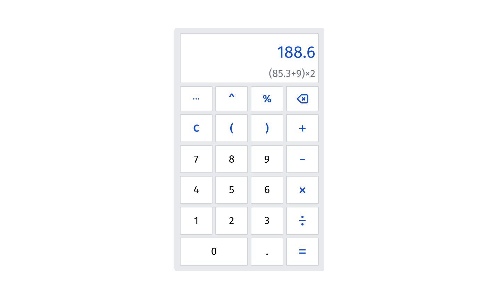

# calculator
A web application to calculate some simple calculations.



## Requirement
- Node.js 12.13.0 or higher

## Setup
```
npm install
```

## How to use
```
npm run serve
```

## Stack
It is created using those amazing technologies:
- [Vue](https://vuejs.org/)
- [Tailwind](https://tailwindcss.com/)
- And many others!
